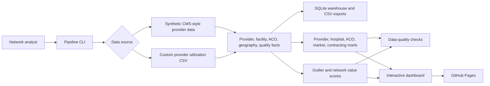

# Provider Network Performance & Value-Based Care Analytics Platform
### A premium analytics command center for provider benchmarking, ACO performance, quality, market opportunity, and contracting strategy

Provider Network Performance & Value-Based Care Analytics Platform is a production-ready healthcare analytics portfolio project that simulates how payer network, ACO, contracting, and value-based care teams evaluate providers across cost, quality, utilization, readmissions, market context, and shared savings performance.

[Live GitHub Pages App](https://mohammed-ghanim-siddiqui.github.io/provider-network-value-based-care-analytics/) | [GitHub Repository](https://github.com/MOHAMMED-GHANIM-SIDDIQUI/provider-network-value-based-care-analytics) | [Deployment Workflow](https://github.com/MOHAMMED-GHANIM-SIDDIQUI/provider-network-value-based-care-analytics/actions/workflows/deploy-pages.yml)


---

## About This Repository

This repository builds a complete provider network and value-based care analytics product. It creates synthetic CMS-style provider utilization, hospital quality, ACO performance, and geographic variation data, then turns those tables into governed marts, statistical scores, and an interactive executive dashboard.

It is designed to show healthcare domain depth across:

- provider peer benchmarking
- cost and utilization variation
- hospital quality and readmission performance
- ACO savings and quality segmentation
- market opportunity analysis
- contracting opportunity scoring
- network value scorecards
- provider outlier queues
- custom provider utilization CSV ingestion
- static GitHub Pages deployment

---

## Important Data Note

Default records are synthetic and generated locally for demonstration. They are not real provider contract records, patient records, payer files, or CMS extracts.

If you use custom data, do not commit confidential payer/provider contracts, PHI, regulated datasets, or private network strategy files to a public repository.

---

## Live Product

| Resource | Link |
|---|---|
| Live app | https://mohammed-ghanim-siddiqui.github.io/provider-network-value-based-care-analytics/ |
| Repository | https://github.com/MOHAMMED-GHANIM-SIDDIQUI/provider-network-value-based-care-analytics |
| Deployment workflow | https://github.com/MOHAMMED-GHANIM-SIDDIQUI/provider-network-value-based-care-analytics/actions/workflows/deploy-pages.yml |
| Blueprint | [docs/Provider_Network_Value_Based_Care_Analytics_Blueprint.md](docs/Provider_Network_Value_Based_Care_Analytics_Blueprint.md) |

---

## Product Index

[Dashboard](#dashboard) . [Use Cases](#business-use-cases) . [Architecture](#architecture) . [Custom Data](#custom-data-support) . [Testing](#quality-assurance) . [Deployment](#deployment) . [Roadmap](#roadmap)

---

## Business Use Cases

| Network question | Platform answer |
|---|---|
| Which providers are cost outliers against peers? | Provider peer benchmark mart with cost and utilization percentiles |
| Which providers are strong value-based contract candidates? | Contracting opportunity score based on volume, quality, efficiency, market need, and stability |
| Which hospitals need quality intervention? | Hospital quality scorecard with readmission, safety, patient experience, and action tiers |
| Which ACOs delivered savings with quality? | ACO quality-cost quadrant and performance tiers |
| Which markets need network strategy attention? | Market opportunity score with cost, utilization, provider density, and quality gap |
| Which providers need operational review? | Outlier queue with recommended actions and export |

---

## Feature Index

| Area | Features |
|---|---|
| Provider identity | NPI-like IDs, specialty, type, market, geography |
| Utilization | Beneficiaries, services, payment, allowed amount, service mix |
| Peer benchmarking | Cost percentile, utilization percentile, payment per beneficiary |
| Hospital quality | Star rating, readmission score, safety, patient experience |
| ACO performance | Savings rate, earned shared savings, quality score, assigned beneficiaries |
| Market analytics | Per-capita cost, ED/admission rates, provider density, quality gaps |
| Scoring | Outlier score, network value score, contracting tier |
| Dashboard | Charts, filters, search, sort, modal detail, triage state, CSV export |
| Deployment | Static dashboard, GitHub Actions, GitHub Pages |

---

## Dashboard

The dashboard includes:

- executive network KPI strip
- specialty payment distribution
- provider cost vs utilization matrix
- hospital quality scorecards
- ACO savings and quality quadrant
- market opportunity table
- contracting opportunity queue
- provider outlier queue
- quality and model governance panel
- dark and light mode
- browser-local queue triage state

---

## Architecture



---

## Repository Structure

```text
provider-network-value-based-care-analytics/
|
|-- README.md
|-- requirements.txt
|-- pyproject.toml
|
|-- src/
|   |-- provider_network_analytics/
|       |-- config.py
|       |-- custom_data.py
|       |-- data_generation.py
|       |-- documentation.py
|       |-- marts.py
|       |-- scoring.py
|       |-- pipeline.py
|       |-- quality.py
|       |-- reporting.py
|       |-- warehouse.py
|
|-- scripts/
|   |-- run_provider_network_pipeline.py
|   |-- serve_dashboard.py
|   |-- build_static_site.py
|
|-- tests/
|   |-- test_pipeline.py
|
|-- docs/
|   |-- Provider_Network_Value_Based_Care_Analytics_Blueprint.md
|
|-- data/
|   |-- raw/
|       |-- custom_provider_utilization_template.csv
```

---

## Tech Stack

| Layer | Tools |
|---|---|
| Language | Python 3.11+ |
| Data | pandas, NumPy |
| Scoring | scikit-learn, peer percentiles |
| Warehouse | SQLite |
| Visuals | Plotly |
| UI | HTML, CSS, JavaScript |
| Tests | pytest |
| CI/CD | GitHub Actions |
| Hosting | GitHub Pages |

---

## Getting Started

```powershell
git clone https://github.com/MOHAMMED-GHANIM-SIDDIQUI/provider-network-value-based-care-analytics.git
cd provider-network-value-based-care-analytics
python -m venv .venv
.\.venv\Scripts\Activate.ps1
pip install -r requirements.txt
python scripts\run_provider_network_pipeline.py
python scripts\serve_dashboard.py
```

Open:

```text
http://127.0.0.1:8062/reports/dashboard/provider_network_vbc_dashboard.html
```

---

## Useful Commands

Build a larger network:

```powershell
python scripts\run_provider_network_pipeline.py --providers 900 --facilities 180 --acos 90 --seed 42
```

Build from custom provider utilization:

```powershell
python scripts\run_provider_network_pipeline.py --custom-provider-utilization data\raw\custom_provider_utilization_template.csv
```

Build static site:

```powershell
python scripts\build_static_site.py
```

Run tests:

```powershell
python -m pytest
```

---

## Custom Data Support

Recommended minimum columns:

```text
provider_id,provider_name,specialty_group,provider_type,state_code,market,beneficiary_count,service_count,medicare_payment_amount,allowed_amount,quality_score,readmission_rate
```

Optional ACO columns:

```text
aco_name,aco_quality_score,aco_savings_rate
```

Sample:

```text
data/raw/custom_provider_utilization_template.csv
```

---

## Main Outputs

| Output | Path |
|---|---|
| SQLite warehouse | `data/processed/provider_network_vbc.db` |
| Interactive dashboard | `reports/dashboard/provider_network_vbc_dashboard.html` |
| Static web artifact | `dist/index.html` |
| Executive summary | `reports/executive_summary.md` |
| Quality report | `reports/data_quality_report.csv` |
| Provider benchmark mart | `data/processed/mart_provider_peer_benchmark.csv` |
| Contracting opportunity mart | `data/processed/mart_contracting_opportunity.csv` |
| ACO performance mart | `data/processed/mart_aco_performance.csv` |
| Hospital quality mart | `data/processed/mart_hospital_quality_scorecard.csv` |

---

## Quality Assurance

```powershell
python -m pytest
```

The test suite verifies synthetic data integrity, marts, scoring, warehouse output, dashboard rendering, and custom provider data ingestion.

---

## Deployment

The GitHub Actions workflow installs dependencies, builds the dashboard, runs tests, creates `dist/index.html`, and deploys to GitHub Pages.

Live app:

```text
https://mohammed-ghanim-siddiqui.github.io/provider-network-value-based-care-analytics/
```

---

## Roadmap

| Phase | Upgrade |
|---|---|
| 1 | Public portfolio dashboard and deployment |
| 2 | Custom upload and provider mapping UI |
| 3 | CMS public file ingestion connectors |
| 4 | Geospatial market maps |
| 5 | Contract simulation and shared savings forecasting |
| 6 | Authenticated multi-user analytics platform |

---

## Author

Built by [MOHAMMED-GHANIM-SIDDIQUI](https://github.com/MOHAMMED-GHANIM-SIDDIQUI).

This project demonstrates provider network analytics, value-based care strategy, ACO performance analysis, hospital quality benchmarking, market opportunity scoring, contracting recommendations, testing, UI design, and public deployment.

